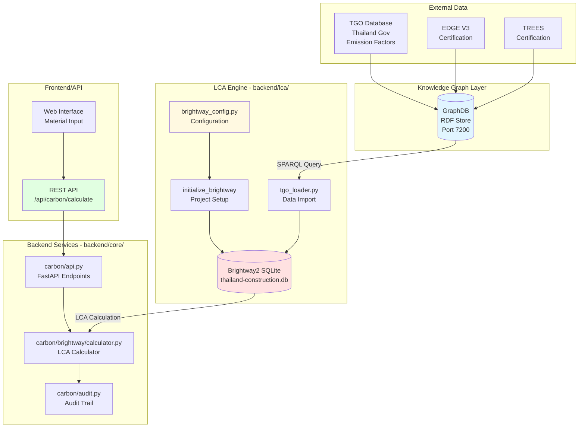
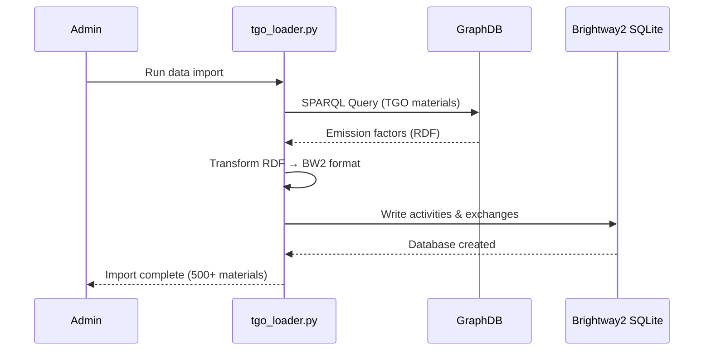
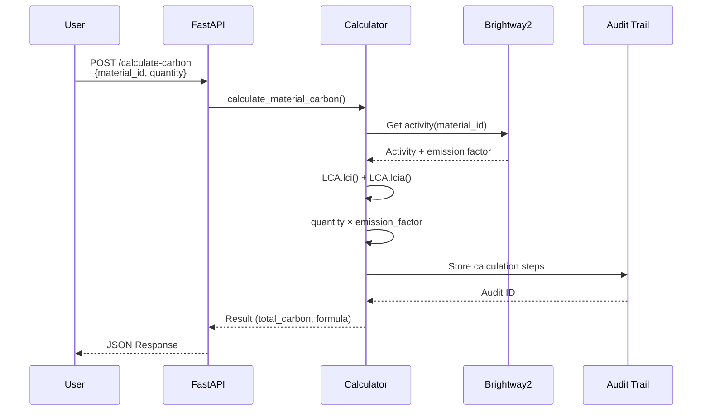
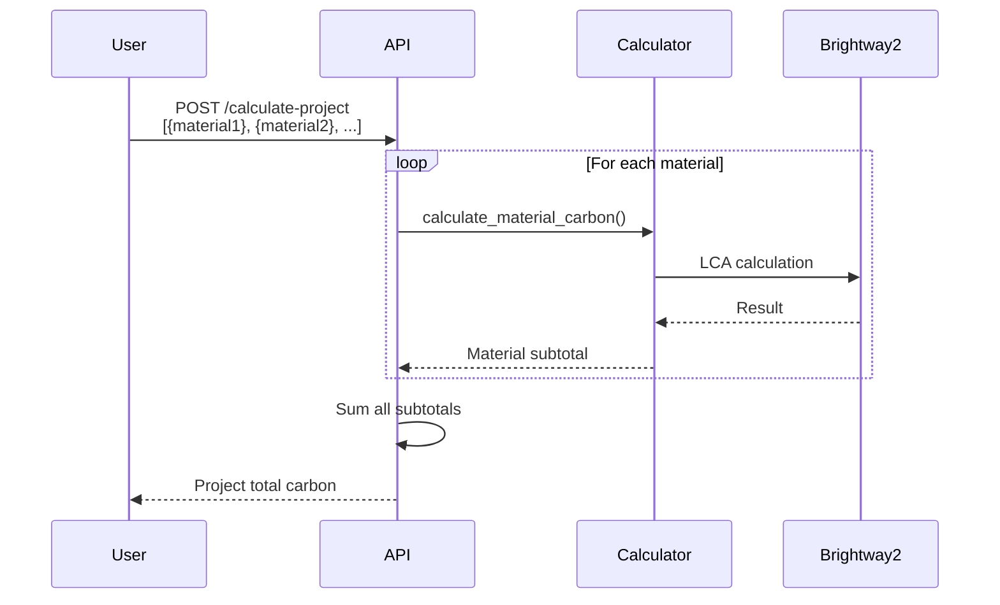

# LCA Integration Architecture

## Overview

This document describes how Brightway2 integrates with the BKS cBIM AI Agent for embodied carbon calculations with Thailand-specific building materials.

## System Architecture



## Data Flow

### 1. TGO Data Loading (One-time Setup)



**SQL Query Example**:
```sparql
PREFIX tgo: <http://bks-cbim-ai.com/ontology/tgo#>

SELECT ?material ?nameEn ?nameTh ?ef ?unit WHERE {
    ?material a tgo:Material ;
              tgo:nameEn ?nameEn ;
              tgo:nameTh ?nameTh ;
              tgo:emissionFactor ?ef ;
              tgo:unit ?unit .
    FILTER(?ef > 0)
}
```

**Brightway2 Activity Format**:
```python
{
    "name": "Concrete C30",
    "unit": "kg",
    "location": "TH",
    "code": "materials/concrete-c30",
    "exchanges": [
        {
            "amount": 1.0,
            "type": "production",
            "input": ("TGO-Thailand-2026", "materials/concrete-c30")
        },
        {
            "amount": 0.15,  # 0.15 kgCO2e/kg
            "type": "biosphere",
            "name": "Carbon dioxide",
            "unit": "kg",
        }
    ]
}
```

### 2. LCA Calculation (Runtime)



**API Request**:
```json
{
    "material_id": "materials/concrete-c30",
    "quantity": 1200,
    "unit": "kg"
}
```

**API Response**:
```json
{
    "material_id": "materials/concrete-c30",
    "quantity": 1200,
    "unit": "kg",
    "total_carbon": 180.0,
    "emission_factor": 0.15,
    "formula": "1200 kg × 0.15 kgCO2e/kg = 180.0 kgCO2e",
    "lifecycle_stages": ["A1", "A2", "A3"],
    "audit_id": "calc_abc123",
    "timestamp": "2026-03-23T10:30:00Z"
}
```

### 3. Project-Level Calculation (Multiple Materials)



## Component Details

### Configuration (`brightway_config.py`)

**Purpose**: Centralized configuration for deterministic LCA

**Key Classes**:
- `DeterministicConfig` - Precision, seeds, static mode
- `ProjectConfig` - Project name, databases, impact methods
- `PathConfig` - Data directory management
- `GraphDBConfig` - Connection to RDF store
- `ValidationConfig` - Accuracy targets (≤2% error)

**Usage**:
```python
from carbonscope.backend.lca import initialize_brightway, DeterministicConfig

# Apply deterministic settings
DeterministicConfig.apply()

# Initialize project
project = initialize_brightway()
```

### Project Initialization

**First Run**:
```python
from carbonscope.backend.lca import initialize_brightway

project = initialize_brightway()
# Creates: backend/lca/data/brightway2/thailand-construction.db
```

**Subsequent Runs**:
```python
import bw2data as bd
bd.projects.set_current("thailand-construction")
# Reuses existing project
```

### TGO Data Loader (Future - Task #21)

**Purpose**: Load emission factors from GraphDB into Brightway2

**File**: `backend/lca/utils/tgo_loader.py`

**Process**:
1. Query GraphDB for TGO materials
2. Transform RDF triples to Brightway2 format
3. Create activities with exchanges
4. Write to SQLite database
5. Verify data integrity

### LCA Calculator (Future - Task #22)

**Purpose**: Perform embodied carbon calculations

**File**: `backend/core/carbon/brightway/calculator.py`

**Methods**:
- `calculate_material_carbon()` - Single material
- `calculate_project_carbon()` - Multi-material project
- `calculate_with_breakdown()` - Detailed lifecycle stages

### Audit Trail (Existing)

**Purpose**: Track all calculations for transparency

**File**: `backend/core/carbon/audit.py`

**Stored Data**:
- Calculation ID
- Timestamp
- Materials used
- Calculation steps
- Final result
- Database version

## Determinism Strategy

### Why Determinism Matters

1. **Regulatory Compliance**: Same inputs must produce same outputs
2. **Consultant Validation**: Results must be reproducible
3. **Audit Trail**: Calculations must be verifiable
4. **Testing**: Enables automated validation

### How Determinism is Achieved

1. **Fixed Random Seeds**:
```python
import random
random.seed(42)

import numpy as np
np.random.seed(42)
```

2. **Disable Monte Carlo**:
```python
MONTE_CARLO_ITERATIONS = 0
USE_STATIC_LCA = True
```

3. **High-Precision Decimal**:
```python
from decimal import Decimal, getcontext
getcontext().prec = 28
```

4. **Static Databases**:
- No runtime updates during calculations
- Versioned databases (TGO-Thailand-2026)

5. **Validation Test**:
```python
# Run same calculation 10 times
results = [calculate() for _ in range(10)]
assert len(set(results)) == 1  # All identical
```

## Performance Optimization

### Target Performance

- **500 materials**: <5 seconds
- **Single material**: <50 milliseconds
- **Project (50 materials)**: <1 second

### Optimization Strategies

1. **Bulk Loading**: Use Turtle format for initial import
2. **Caching**: Cache emission factors (1 hour TTL)
3. **Batch Processing**: Group similar materials
4. **Index Optimization**: SQLite indexes on material_id
5. **Connection Pooling**: Reuse database connections

### Monitoring

```python
import time

start = time.time()
result = calculator.calculate_material_carbon(...)
duration = time.time() - start

if duration > 0.05:  # 50ms threshold
    logger.warning(f"Slow calculation: {duration:.3f}s")
```

## Integration Points

### Point 1: GraphDB SPARQL Endpoint

**Location**: `http://localhost:7200/repositories/tgo-emission-factors`

**Query Method**:
```python
from SPARQLWrapper import SPARQLWrapper

endpoint = "http://localhost:7200/repositories/tgo-emission-factors"
sparql = SPARQLWrapper(endpoint)
sparql.setQuery(query)
results = sparql.query().convert()
```

### Point 2: Brightway2 SQLite Database

**Location**: `backend/lca/data/brightway2/thailand-construction.db`

**Access Method**:
```python
import bw2data as bd
bd.projects.set_current("thailand-construction")
db = bd.Database("TGO-Thailand-2026")
```

### Point 3: FastAPI Endpoints

**Location**: `backend/api.py`

**Endpoint Registration**:
```python
from carbonscope.backend.core.carbon.api import router as carbon_router
app.include_router(carbon_router, prefix="/api/carbon")
```

### Point 4: Frontend Integration

**API Call**:
```typescript
const response = await fetch('/api/carbon/calculate', {
    method: 'POST',
    headers: { 'Content-Type': 'application/json' },
    body: JSON.stringify({
        material_id: 'materials/concrete-c30',
        quantity: 1200,
        unit: 'kg'
    })
});
const result = await response.json();
```

## Security Considerations

### Data Protection

1. **Read-Only Access**: LCA database is read-only during calculations
2. **Input Validation**: Sanitize material_id and quantity
3. **Rate Limiting**: Prevent DoS on calculation endpoints
4. **Audit Logging**: Track all calculation requests

### Configuration Security

1. **Environment Variables**: Store GraphDB credentials in `.env`
2. **File Permissions**: Restrict access to SQLite databases
3. **API Authentication**: Require auth tokens for endpoints

## Error Handling

### Common Errors

1. **Material Not Found**:
```python
try:
    activity = bd.get_activity((db_name, material_id))
except KeyError:
    raise MaterialNotFoundError(f"Material {material_id} not in database")
```

2. **Database Locked**:
```python
try:
    db.write(activities)
except sqlite3.OperationalError:
    logger.error("Database locked - retry in 1s")
    time.sleep(1)
    db.write(activities)
```

3. **Calculation Timeout**:
```python
import signal
signal.alarm(60)  # 60-second timeout
try:
    lca.lci()
    lca.lcia()
except TimeoutError:
    raise CalculationTimeoutError("LCA took >60s")
finally:
    signal.alarm(0)
```

## Testing Strategy

### Test Levels

1. **Unit Tests**: Individual functions
2. **Integration Tests**: GraphDB → Brightway2
3. **Calculation Tests**: Accuracy validation
4. **Performance Tests**: Speed benchmarks
5. **Determinism Tests**: Reproducibility

### Test Execution

```bash
# All tests
pytest backend/lca/tests/ -v

# Specific test class
pytest backend/lca/tests/test_brightway_setup.py::TestBrightway2Imports -v

# With coverage
pytest backend/lca/tests/ --cov=carbonscope.backend.lca --cov-report=html
```

## Future Enhancements

### Phase 1 (Current)
- ✓ Brightway2 installation
- ✓ Configuration setup
- ✓ Basic tests

### Phase 2 (Next)
- TGO data loader implementation
- API endpoint integration
- Consultant validation

### Phase 3 (Future)
- EDGE/TREES certification automation
- Real-time updates from GraphDB
- Multi-scenario analysis

### Phase 4 (Advanced)
- Machine learning for uncertainty
- Parametric design optimization
- Whole building LCA

---

**Last Updated**: 2026-03-23
**Document Version**: 1.0.0
