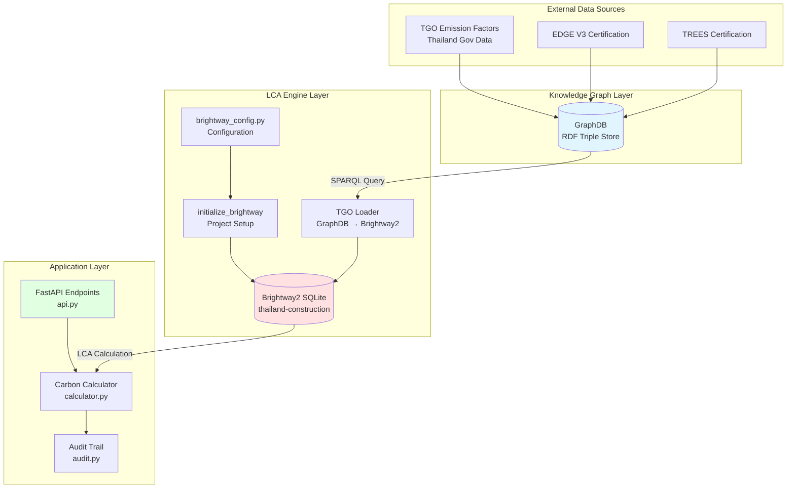

# Brightway2 LCA Integration

This directory contains the Brightway2 Life Cycle Assessment (LCA) integration for the BKS cBIM AI Agent project. It provides deterministic, reproducible embodied carbon calculations for Thailand-specific building materials.

## Table of Contents

- [Overview](#overview)
- [System Requirements](#system-requirements)
- [Installation](#installation)
- [Configuration](#configuration)
- [Project Structure](#project-structure)
- [Quick Start](#quick-start)
- [Integration Architecture](#integration-architecture)
- [Testing](#testing)
- [Troubleshooting](#troubleshooting)

---

## Overview

### What is Brightway2?

[Brightway2](https://docs.brightway.dev/) is a Python framework for Life Cycle Assessment (LCA) that provides:

- **ISO 14040/14044 compliance**: Industry-standard LCA methodology
- **Deterministic calculations**: Same inputs always produce same outputs
- **High performance**: <5s for 500 materials
- **SQLite storage**: Persistent, queryable LCA databases
- **Extensibility**: Custom impact assessment methods

### Project Goals

- **Consultant-grade accuracy**: ≤2% error vs manual assessments
- **Thailand-specific data**: Integration with TGO emission factors
- **EDGE/TREES certification**: Support green building standards
- **Deterministic mode**: Reproducible calculations for audit trails
- **GraphDB integration**: Real-time data from knowledge graph

---

## System Requirements

### Python Version

- **Python 3.12+** (project standard)

### Dependencies

Core Brightway2 packages:

- `brightway2>=2.5.0` - Main framework
- `bw2data>=4.0.0` - Data management
- `bw2calc>=2.0.0` - LCA calculations
- `bw2io>=0.9.0` - Import/export utilities

Additional requirements:

- `rdflib>=7.6.0` - RDF graph manipulation (already in project)
- `SPARQLWrapper>=2.0.0` - GraphDB queries (already in project)
- `python-dotenv>=1.0.0` - Configuration management

### System Resources

- **Disk space**: 500MB for Brightway2 databases
- **Memory**: 2GB minimum, 4GB recommended
- **CPU**: Multi-core recommended for large projects

---

## Installation

### Step 1: Virtual Environment (Recommended)

If not using the project's existing virtual environment:

```bash
cd /teamspace/studios/this_studio/comprehensive-bks-cbim-ai-agent/backend
python3 -m venv .venv
source .venv/bin/activate  # On Linux/Mac
# or
.venv\Scripts\activate  # On Windows
```

### Step 2: Install Brightway2

Using `uv` (project standard):

```bash
cd /teamspace/studios/this_studio/comprehensive-bks-cbim-ai-agent/backend
uv pip install brightway2>=2.5.0 bw2data>=4.0.0 bw2calc>=2.0.0 bw2io>=0.9.0
```

Or using pip:

```bash
pip install brightway2>=2.5.0 bw2data bw2calc bw2io
```

### Step 3: Verify Installation

```python
python3 -c "import bw2data; print(bw2data.__version__)"
```

Expected output: `4.0.0` or higher

### Step 4: Initialize Project

```python
from carbonscope.backend.lca.brightway_config import initialize_brightway

# Initialize Brightway2 with deterministic configuration
project_name = initialize_brightway()
print(f"Initialized project: {project_name}")
```

This will:
- Create `backend/lca/data/brightway2/` directory
- Set up the "thailand-construction" project
- Apply deterministic configuration (fixed seeds, high precision)

---

## Configuration

### Configuration File

All settings are centralized in `brightway_config.py`:

```python
from carbonscope.backend.lca.brightway_config import (
    DeterministicConfig,
    ProjectConfig,
    PathConfig,
    GraphDBConfig,
    ValidationConfig,
)
```

### Key Configuration Classes

#### 1. DeterministicConfig

Ensures reproducible calculations:

```python
DECIMAL_PRECISION = 28           # Significant figures
RANDOM_SEED = 42                 # Fixed seed
MONTE_CARLO_ITERATIONS = 0       # Disable uncertainty
USE_STATIC_LCA = True            # Deterministic mode
```

#### 2. ProjectConfig

Brightway2 project settings:

```python
PROJECT_NAME = "thailand-construction"
DATABASE_NAME = "TGO-Thailand-2026"
IMPACT_METHOD = ("IPCC 2021", "climate change", "GWP 100a")
DEFAULT_STAGES = ["A1", "A2", "A3"]  # Product stage only
```

#### 3. PathConfig

Data storage locations:

```python
BASE_DIR = /path/to/backend/lca
DATA_DIR = BASE_DIR / "data"
BRIGHTWAY_DIR = DATA_DIR / "brightway2"
```

#### 4. GraphDBConfig

Connection to TGO emission factors:

```python
ENDPOINT = "http://localhost:7200"
REPOSITORY = "tgo-emission-factors"
TGO_NAMESPACE = "http://bks-cbim-ai.com/ontology/tgo#"
```

### Environment Variables

Override defaults via `.env`:

```bash
# GraphDB connection
GRAPHDB_ENDPOINT=http://graphdb.example.com:7200
GRAPHDB_REPOSITORY=tgo-emission-factors

# Logging
LCA_LOG_LEVEL=DEBUG

# Custom Brightway2 directory (optional)
BRIGHTWAY2_DIR=/custom/path/to/brightway2
```

---

## Project Structure

```
backend/lca/
├── README.md                           # This file (main documentation)
├── DETERMINISTIC_MODE_GUIDE.md         # Comprehensive determinism guide ⭐ NEW
├── DETERMINISTIC_QUICKSTART.md         # Quick reference for developers ⭐ NEW
├── TASK_27_COMPLETION.md               # Task #27 completion report ⭐ NEW
├── INSTALL.md                          # Installation guide
├── QUICKSTART.md                       # Quick start guide
├── ARCHITECTURE.md                     # System architecture
├── brightway_config.py                 # Configuration (enhanced for determinism)
├── validate_deterministic.py           # Validation script ⭐ NEW
├── carbon_calculator.py                # LCA calculator
├── material_matcher.py                 # Material matching logic
├── unit_converter.py                   # Unit conversion utilities
├── verify_installation.py              # Installation verification
├── __init__.py                         # Module initialization
├── data/                               # LCA data storage
│   └── brightway2/                     # Brightway2 SQLite databases
│       ├── thailand-construction.db
│       └── projects/
└── tests/                              # Test suite
    ├── __init__.py
    ├── test_brightway_setup.py         # Installation tests
    ├── test_deterministic.py           # Determinism tests ⭐ NEW
    ├── test_carbon_calculator.py       # Calculator tests
    └── (more test files to come)
```

---

## Quick Start

### 1. Initialize Project

```python
from carbonscope.backend.lca.brightway_config import initialize_brightway

# First-time setup
project = initialize_brightway()
print(f"Project: {project}")
# Output: Project: thailand-construction
```

### 2. Check Project Status

```python
import bw2data as bd

# List all projects
print(bd.projects)

# Get current project
print(bd.projects.current)
# Output: thailand-construction

# List databases
print(bd.databases)
# Output: {} (empty initially)
```

### 3. Create Test Database

```python
import bw2data as bd
from decimal import Decimal

# Create a simple database
db = bd.Database("test-materials")
db.write({
    ("test-materials", "concrete-c30"): {
        "name": "Concrete C30",
        "unit": "kg",
        "location": "TH",
        "exchanges": [{
            "amount": 0.15,  # 0.15 kgCO2e per kg
            "type": "biosphere",
            "unit": "kg CO2e",
            "input": ("biosphere", "CO2"),
        }],
    },
})

print("Database created:", db.name)
```

### 4. Perform Simple Calculation

```python
import bw2data as bd
import bw2calc as bc

# Get activity
concrete = bd.get_activity(("test-materials", "concrete-c30"))

# Create functional unit (1000 kg concrete)
functional_unit = {concrete: 1000}

# Calculate LCA
lca = bc.LCA(functional_unit)
lca.lci()
lca.lcia()

print(f"Embodied carbon: {lca.score} kg CO2e")
# Output: Embodied carbon: 150.0 kg CO2e
```

### 5. Test Determinism

```python
from carbonscope.backend.lca.brightway_config import DeterministicConfig

# Run same calculation 10 times
results = []
for i in range(10):
    lca = bc.LCA(functional_unit)
    lca.lci()
    lca.lcia()
    results.append(lca.score)

# All results should be identical
assert len(set(results)) == 1, "Non-deterministic results!"
print(f"All {len(results)} runs produced: {results[0]} kg CO2e")
```

---

## Integration Architecture



### Data Flow

1. **TGO Data Loading** (GraphDB → Brightway2):
   - SPARQL query fetches emission factors from GraphDB
   - `tgo_loader.py` transforms RDF to Brightway2 format
   - Data written to SQLite database

2. **LCA Calculation** (Brightway2 → Results):
   - FastAPI endpoint receives material quantities
   - Calculator queries Brightway2 database
   - Deterministic LCA computation
   - Results stored with audit trail

3. **EDGE/TREES Integration** (Future):
   - Certification queries reference Brightway2 results
   - Automated compliance checking
   - Report generation with calculations

### Integration Points

#### Point 1: GraphDB → Brightway2

```python
# Query TGO emission factors
query = """
PREFIX tgo: <http://bks-cbim-ai.com/ontology/tgo#>
SELECT ?material ?name ?ef ?unit WHERE {
    ?material a tgo:Material ;
              tgo:nameEn ?name ;
              tgo:emissionFactor ?ef ;
              tgo:unit ?unit .
}
"""

# Transform to Brightway2 format
activities = []
for row in results:
    activities.append({
        "name": row["name"],
        "unit": row["unit"],
        "exchanges": [{
            "amount": float(row["ef"]),
            "type": "biosphere",
            "unit": "kg CO2e",
        }],
    })

# Write to Brightway2
db = bd.Database("TGO-Thailand-2026")
db.write(activities)
```

#### Point 2: Brightway2 → API

```python
from fastapi import APIRouter
from carbonscope.backend.lca.brightway_config import ProjectConfig
import bw2data as bd

router = APIRouter()

@router.post("/calculate-carbon")
async def calculate_carbon(material_id: str, quantity: float):
    # Get activity from Brightway2
    activity = bd.get_activity(("TGO-Thailand-2026", material_id))

    # Calculate LCA
    lca = bc.LCA({activity: quantity})
    lca.lci()
    lca.lcia()

    return {
        "material_id": material_id,
        "quantity": quantity,
        "embodied_carbon": lca.score,
        "unit": "kg CO2e"
    }
```

---

## Testing

### Run All Tests

```bash
cd /teamspace/studios/this_studio/comprehensive-bks-cbim-ai-agent/backend
pytest lca/tests/ -v
```

### Test Categories

#### 1. Installation Tests (`test_brightway_setup.py`)

- Verify Brightway2 imports
- Test project creation
- Check database operations

```bash
pytest lca/tests/test_brightway_setup.py -v
```

#### 2. Determinism Tests (`test_determinism.py`)

- 10-run reproducibility check
- Fixed seed validation
- Decimal precision verification

```bash
pytest lca/tests/test_determinism.py -v
```

#### 3. Integration Tests (`test_tgo_integration.py`)

- GraphDB connection
- SPARQL queries
- TGO data loading

```bash
pytest lca/tests/test_tgo_integration.py -v
```

#### 4. Calculation Tests (`test_calculations.py`)

- Single material calculations
- Multi-material projects
- Unit conversions
- Edge cases

```bash
pytest lca/tests/test_calculations.py -v
```

### Expected Test Results

All tests should pass with:
- ✓ Determinism: 10/10 runs identical
- ✓ Calculation accuracy: ≤2% error
- ✓ Performance: 500 materials <5s

---

## Deterministic Mode (Task #27)

### Why Determinism Matters

**Deterministic calculations** ensure that identical inputs always produce identical outputs, which is critical for:

- **Consultant Validation**: External auditors must reproduce results exactly
- **Regulatory Compliance**: Government agencies require reproducible calculations
- **EDGE/TREES Certification**: Certification bodies need consistent numbers
- **Change Tracking**: Detect material changes vs calculation drift
- **Automated Testing**: CI/CD pipelines need predictable outcomes

### Quick Start

```python
from carbonscope.backend.lca.brightway_config import initialize_brightway
from carbonscope.backend.core.carbon.brightway.calculator import CarbonCalculator
from decimal import Decimal

# Initialize once at startup
initialize_brightway(validate=True)

# Use normally - determinism is automatic!
calculator = CarbonCalculator()
result = calculator.calculate_material_carbon(
    material_id="concrete-c30",
    quantity=Decimal("1000.0"),  # Always use Decimal, not float!
    unit="kg"
)
```

### Key Configuration

```python
RANDOM_SEED = 42              # Fixed seed
DECIMAL_PRECISION = 28        # High precision
MONTE_CARLO_ITERATIONS = 0    # No randomness
USE_STATIC_LCA = True         # Deterministic mode
```

### Validation

```bash
# Quick validation
python lca/validate_deterministic.py

# Full test suite
pytest lca/tests/test_deterministic.py -v
```

### Documentation

- **[DETERMINISTIC_MODE_GUIDE.md](DETERMINISTIC_MODE_GUIDE.md)**: Complete guide with troubleshooting
- **[DETERMINISTIC_QUICKSTART.md](DETERMINISTIC_QUICKSTART.md)**: One-page quick reference
- **[TASK_27_COMPLETION.md](TASK_27_COMPLETION.md)**: Implementation details

### Important Rules

✅ **DO**:
- Initialize with `initialize_brightway(validate=True)` at startup
- Use `Decimal("1000.0")` for all quantities
- Call `reset_brightway()` between test runs
- Validate in CI/CD pipeline

❌ **DON'T**:
- Use float for quantities: `1000.0` ← Wrong
- Skip initialization
- Use `datetime.now()` in calculations (metadata only)
- Enable parallel processing

---

## Troubleshooting

### Issue 1: Import Error

**Error**: `ImportError: No module named 'bw2data'`

**Solution**:
```bash
# Ensure Brightway2 is installed
uv pip install brightway2>=2.5.0 bw2data bw2calc bw2io

# Or use pip
pip install brightway2
```

### Issue 2: Project Not Found

**Error**: `ValueError: Project 'thailand-construction' does not exist`

**Solution**:
```python
from carbonscope.backend.lca.brightway_config import initialize_brightway
initialize_brightway()  # Creates project if missing
```

### Issue 3: Non-Deterministic Results

**Error**: Calculations produce different results on each run

**Solution**:
```python
# Apply deterministic config before any calculations
from carbonscope.backend.lca.brightway_config import DeterministicConfig
DeterministicConfig.apply()

# Or reinitialize project
from carbonscope.backend.lca.brightway_config import initialize_brightway
initialize_brightway()
```

### Issue 4: GraphDB Connection Failed

**Error**: `ConnectionError: Could not connect to GraphDB`

**Solution**:
```bash
# Check GraphDB is running
curl http://localhost:7200/repositories/tgo-emission-factors

# Update .env with correct endpoint
echo "GRAPHDB_ENDPOINT=http://localhost:7200" >> .env

# Verify repository exists
# See docs/graphdb-setup-guide.md
```

### Issue 5: Database Locked

**Error**: `sqlite3.OperationalError: database is locked`

**Solution**:
```python
# Close all Brightway2 connections
import bw2data as bd
bd.databases.clean()

# Remove lock file if still present
import os
from carbonscope.backend.lca.brightway_config import PathConfig
lock_file = PathConfig.BRIGHTWAY_DIR / "thailand-construction.db-journal"
if lock_file.exists():
    lock_file.unlink()
```

### Issue 6: Performance Issues

**Symptom**: Calculations take >5s for 500 materials

**Solution**:
```python
# Enable caching (future feature)
from carbonscope.backend.lca.brightway_config import PerformanceConfig
print(f"Cache TTL: {PerformanceConfig.CACHE_TTL}s")

# Profile calculations
import cProfile
cProfile.run("lca.lci(); lca.lcia()")

# Consider batch processing for large projects
```

### Issue 7: Precision Errors

**Symptom**: Results differ by small amounts (e.g., 150.0000001 vs 150.0)

**Solution**:
```python
# Ensure Decimal type is used
from decimal import Decimal
from carbonscope.backend.lca.brightway_config import DeterministicConfig

# Check precision setting
print(f"Decimal precision: {DeterministicConfig.DECIMAL_PRECISION}")

# Use Decimal for all calculations
quantity = Decimal("1000.0")  # Not float(1000.0)
```

---

## Additional Resources

### Documentation

- [Brightway2 Official Docs](https://docs.brightway.dev/)
- [ISO 14040:2006 - LCA Principles](https://www.iso.org/standard/37456.html)
- [ISO 14044:2006 - LCA Requirements](https://www.iso.org/standard/38498.html)
- [GraphDB Setup Guide](../../../docs/graphdb-setup-guide.md)
- [TGO Manual Data Entry](../../../docs/tgo-manual-entry.md)

### Project References

- **Task #13**: TGO Manual Data Entry (fallback plan)
- **Task #19**: GraphDB Setup (prerequisite)
- **Task #20**: Brightway2 Installation (this document)
- **Task #27**: Configure Deterministic Mode (COMPLETED ✅)
- **Wave 4**: Brightway2 LCA Integration

### Deterministic Mode Documentation

- **[DETERMINISTIC_MODE_GUIDE.md](DETERMINISTIC_MODE_GUIDE.md)**: Comprehensive guide to deterministic calculations
- **[DETERMINISTIC_QUICKSTART.md](DETERMINISTIC_QUICKSTART.md)**: Quick reference for developers
- **[TASK_27_COMPLETION.md](TASK_27_COMPLETION.md)**: Task completion report and implementation details

### Contact & Support

- **Project Repository**: https://github.com/cbim-ai/carbonscope
- **Brightway2 Forum**: https://brightway.groups.io/
- **Issue Tracker**: GitHub Issues

---

## Next Steps

1. **Complete installation**: Follow steps above
2. **Run tests**: Verify setup with `pytest lca/tests/`
3. **Load TGO data**: Implement `tgo_loader.py` (Task #21)
4. **Integrate API**: Add FastAPI endpoints (Task #22)
5. **Validate accuracy**: Compare with manual assessments (Task #23)

---

**Last Updated**: 2026-03-23
**Version**: 1.0.0
**Status**: Installation & configuration complete
